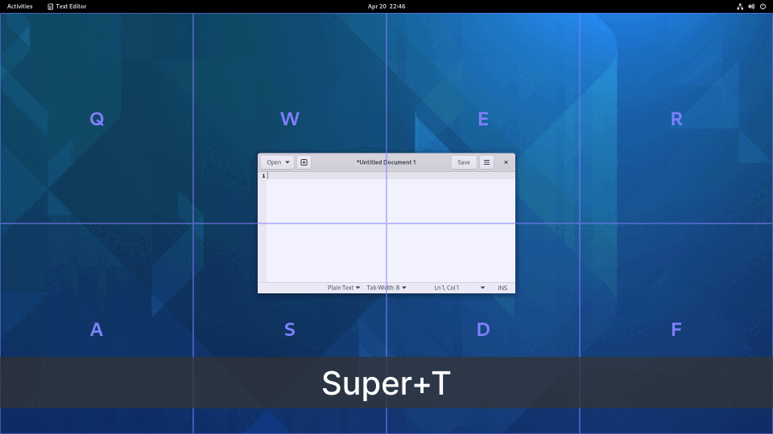
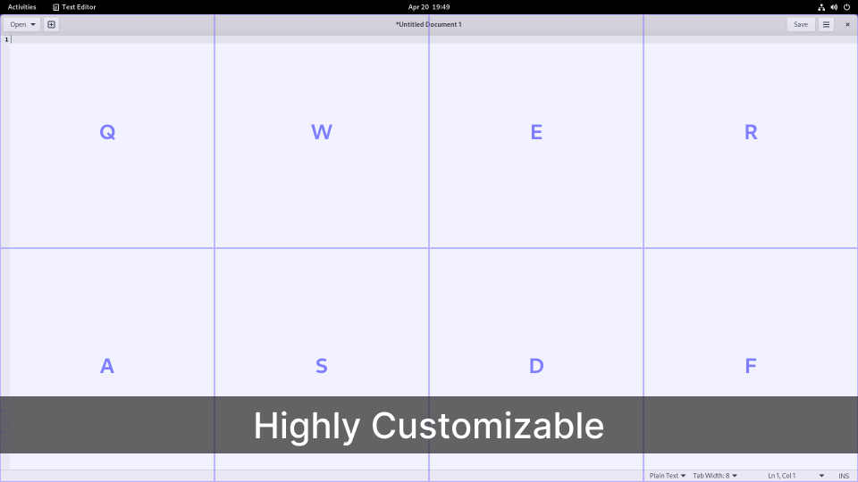
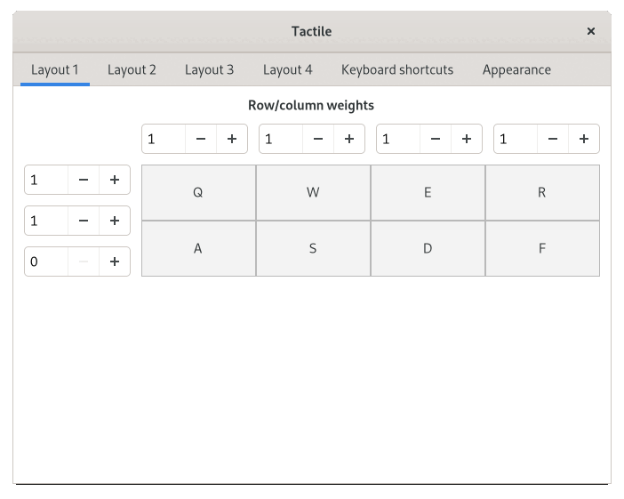

# Tactile

A window tiling extension for GNOME Shell.

> Tile windows on a custom grid using your keyboard. Type Super-T to show the grid,
> then type two tiles (or the same tile twice) to move the active window.
>
> The grid can be up to 4x3 (corresponding to one hand on the keyboard)
> and each row/column can be weighted to take up more or less space.

https://extensions.gnome.org/extension/4548/tactile/

## Examples

## Common issues

- **The window extends to the right and/or bottom of the selected tile(s)**

  Most likely, the window's minimum width or height is larger than the target tile(s).
  If so, there is nothing Tactile can do. Parts of the window will overflow to the right and/or bottom.
  You can test this with LibreOffice Writer, which has no minimum size.

- **The window resizes but does not move, or moves but does not resize**

  New versions of GNOME tend to introduce bugs in the window handling on Wayland.
  These are normally fixed after a couple of weeks. Check if the issue disappears on Xorg.
  If so, it likely can't be fixed in Tactile, but please file an issue to let me know.

## License

Tactile is distributed under the terms of the GNU General Public License v3.0 or later.
See the [license](LICENSE) file for details.
